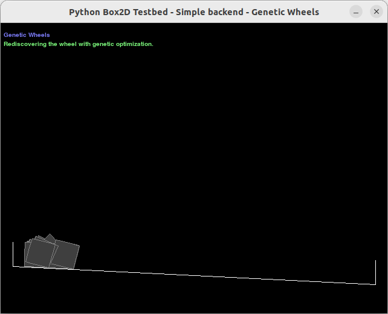
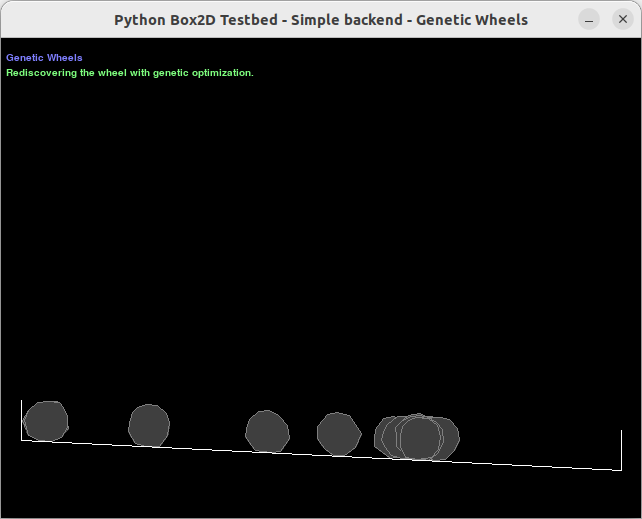
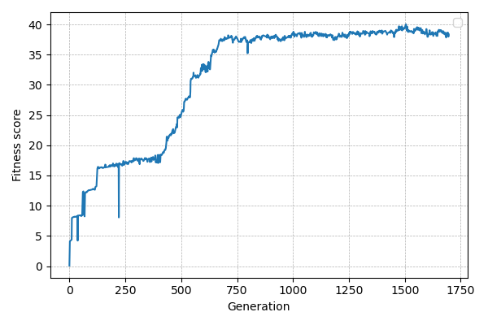

# GeneticWheels

Rediscovering the wheel with genetic optimization.

This project uses [PyBox2D](https://github.com/pybox2d/pybox2d) and [PyGame](https://github.com/pygame/pygame) to create a simple simulation environment consisting of an inclined plane and polygons. Square boxes representing the population are released on the outer left side of the inclined plane, with the goal of reaching the other side. The boxes are represented as polygons described by a list of vertices. These vertices can be modified during a genetic process to find polygon shapes that can move further down the inclined plane.

Generation 1 | Generation 1000
:----:|:----:|
 | 
# Method

In the genetic optimization method, mutation is used as the only genetic operator, as this has proven to work very well. The fitness value is simply the distance traveled in the positive x-direction. Since the number of simulation steps for each generation is limited, the optimization process can also select for the fastest wheels.

The rendering can be turned off by pressing the spacebar to speed up the optimization by several orders of magnitude.

# Results

With a population size of $32$ wheels, a mutation probability of $0.5$, and a mutation rate of $0.04$, the initial configuration of squares evolves in about 750 generations into roundish polygons that can roll down the inclined plane without difficulty. 

# License

MIT